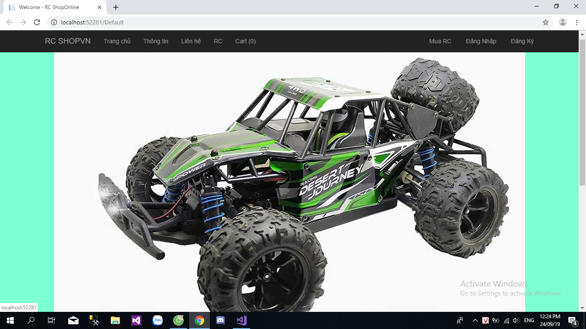
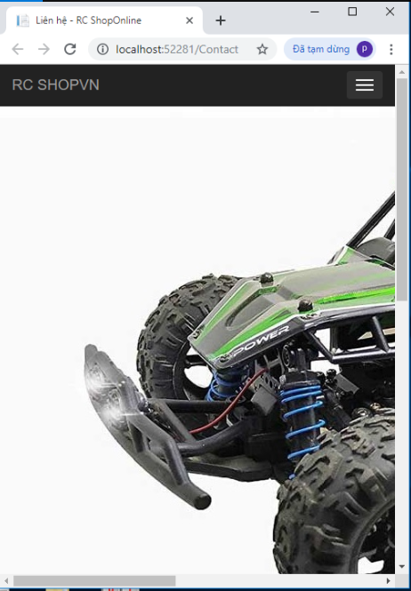
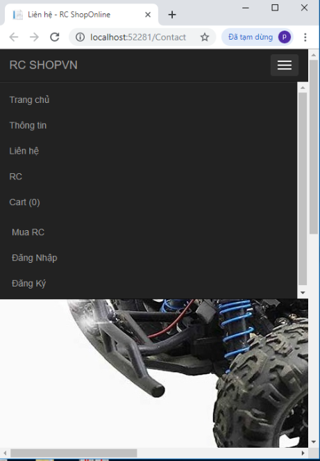
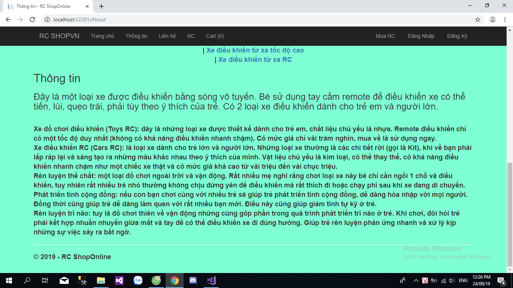
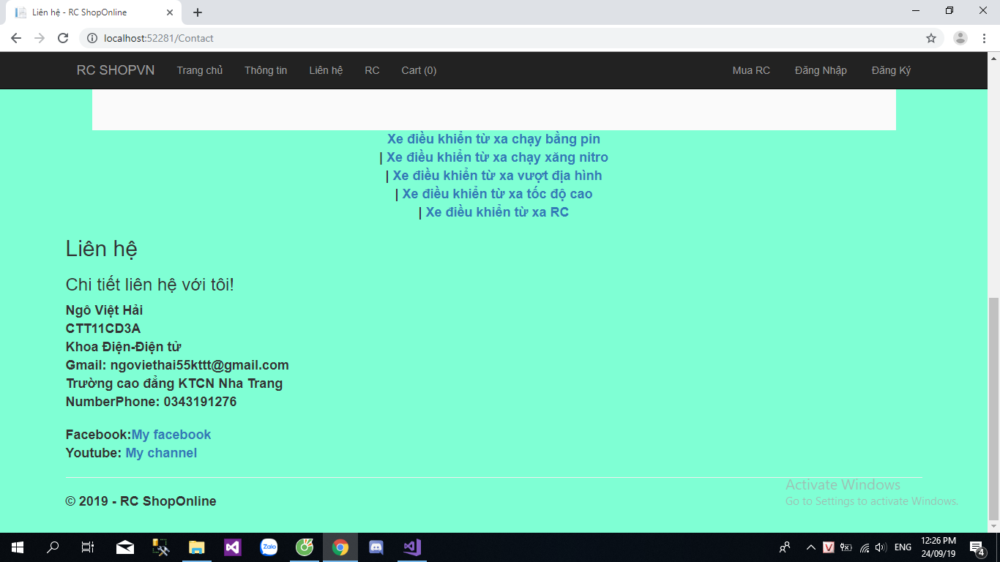
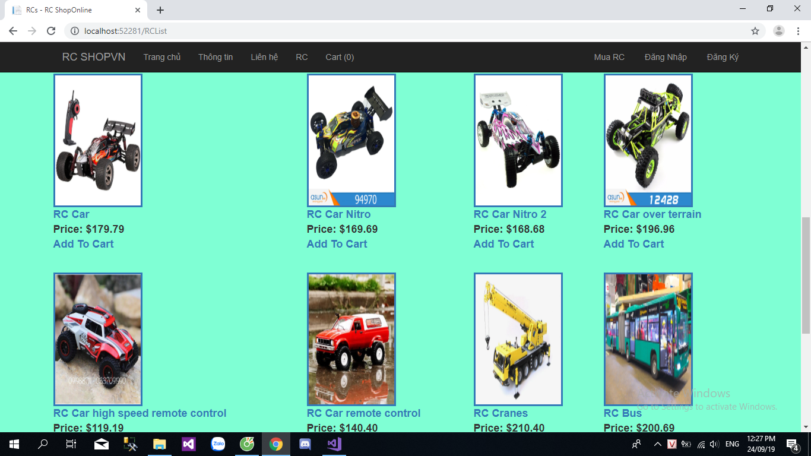
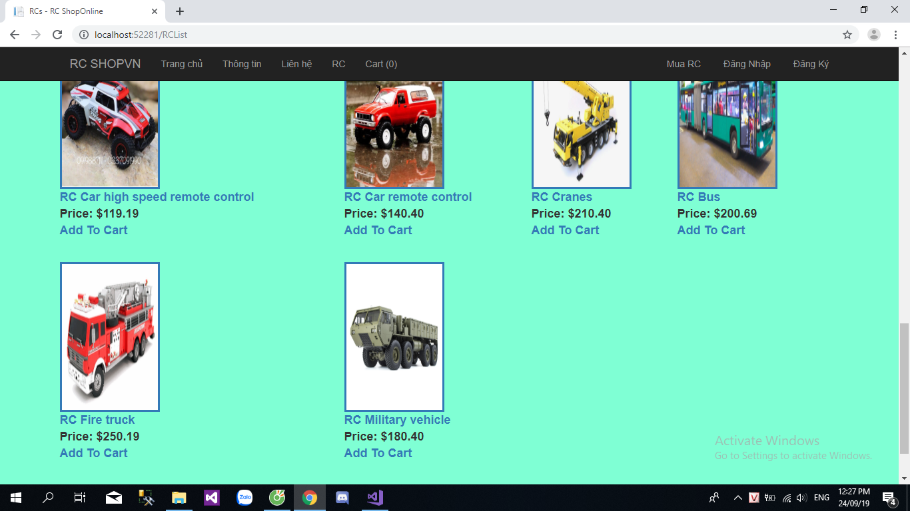
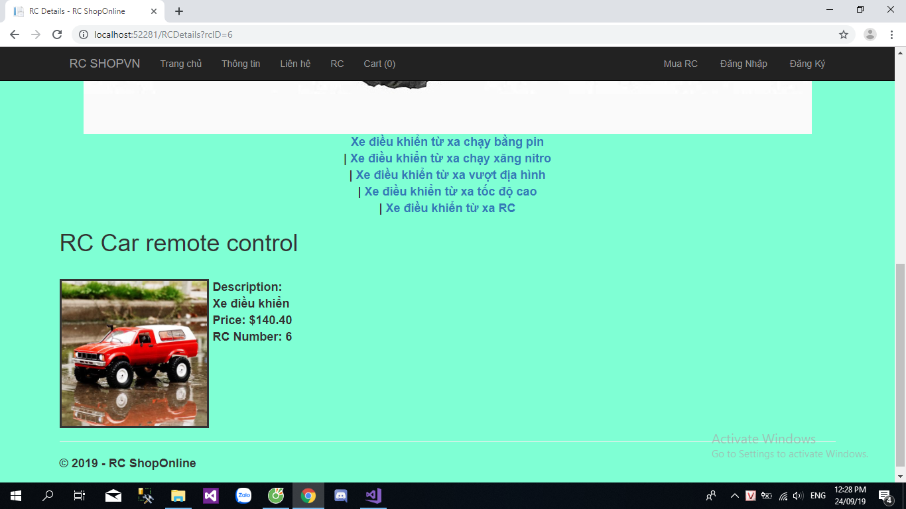
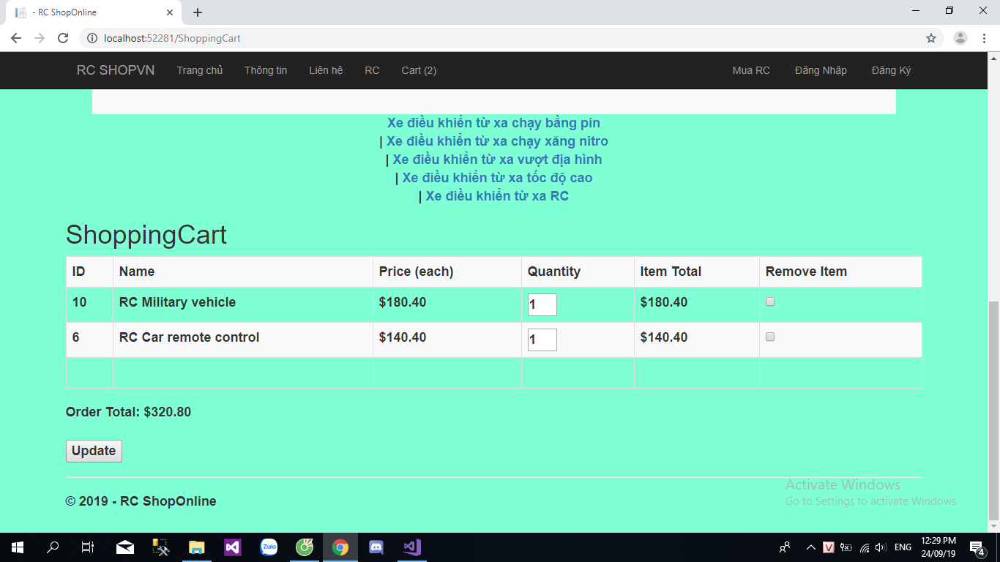

<h1>Bài tập Web Thương Mại RC SHOP ONLINE
 
Giới thiệu các loại dòng xe điều khiển từ xa (RC)</h1>
 
<h2>Hình ảnh giao diện trang chủ </h2>

 
Giao diện tương thích với nhiều màn hình khác nhau: như smartphone, máy tính bảng,ipad,tablet,...
 

 

 
<h3>Phần thông tin giới thiệu RC là gì.</h3>

 
<h4>Phần liên hệ.</h4>

 
<h5>Phần tổng hợp các loại dòng xe ưa thích hiện nay.</h5>

 

 
Phần chi tiết của dòng xe
 

 
Phần giỏ hàng khi bạn mua hàng hiển thị rõ chi tiết và giá tiền tổng giá trị món hàng bạn mua
 

